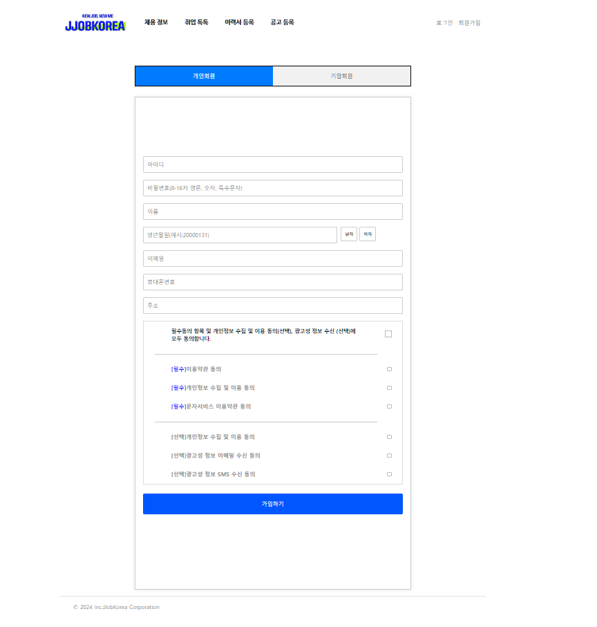

#  짭코리아

## 📄 목차

- 프로젝트 소개
- 개발 기간
- 개발 방식 및 팀원 소개
- 개발 전 화면 설계 및 기능 정의서 작성
- 각 페이지 설명
    - [메인 페이지](#메인-페이지)
    - [로그인 페이지](#)
    - [회원 가입 페이지](#)
    - [채용 정보 페이지](#)
    - [채용 공고 상세 조회 페이지](#)
    - [취업 톡톡 페이지](#)
    - [이력서 등록 페이지](#)
    - [공고 등록 페이지](#)

## 🚀 프로젝트 소개

**잡코리아를 벤치 마킹한 구인 구직 사이트입니다.**

## 📅 개발 기간

2024.07.02 - 2024.07.17

## 👩‍💻 개발 방식 및 팀원 소개

**팀원 모두 풀 스택 개발 방식을 채택하여 프로젝트를 개발하였습니다.**

각 팀원은 다음과 같은 페이지를 담당하였습니다

- [박유진/팀장]: 메인 페이지, 채용 정보 페이지
- [김태후/팀원]: 채용 공고 상세 조회 페이지, 공고 등록 페이지
- [조해욱/팀원]: 구직자 게시판 페이지(취업 톡톡) CRUD 
- [문균호/팀원]: 로그인 페이지, 회원 가입 페이지
- [한도훈/팀원]: 이력서 페이지 CRUD

## 📋 개발 전 화면 설계 및 기능 정의서 작성
- [메인 페이지](화면설계/메인페이지.md)
- [로그인 페이지](화면설계/로그인페이지.md)
- [회원 가입 페이지](화면설계/회원가입페이지.md)
- [채용 정보 페이지](화면설계/채용정보페이지.md)
- [구직자 이력서 페이지](화면설계/구직자이력서작성페이지.md)
- [구직자 이력서 작성 페이지](화면설계/구직자이력서작성페이지.md)
- [기업 등록 페이지](화면설계/기업정보작성,채용정보상세.md)
- [공고 출력 페이지](화면설계/기업정보작성,채용정보상세.md)
- [구직자 게시판 페이지](화면설계/구직자게시판페이지.md)
- [구직자 별점 평가 페이지](화면설계/구직자별점평가구현기능.md)

## ⚡ 페이지 설명

## 🚀 메인 페이지

### 🖥️ 메인 페이지 전체 화면

## 📝기능 설명

### 📌 네비게이션

- 각 항목을 클릭하면 해당 페이지로 이동합니다.
- 로고를 클릭하면 메인 페이지로 이동합니다.

### 📌 지금 뜨는 채용 공고 TOP 8 (✨특별 기능✨)

**: 조회수를 반영하여 선정된 인기 있는 채용 공고 순위를 확인할 수 있는 기능**

- 매일 아침 9시에 채용 공고들의 조회수를 0으로 초기화합니다.
- 모집 마감 기한이 지난 채용 공고는 순위에 반영되지 않습니다.
- 메인 페이지에 접속할 때마다 최신 조회수가 반영됩니다.
- 조회수가 동일한 경우, 기업 이름을 오름차순으로 정렬하여 순위를 매깁니다.
- 첫 번째 행 왼쪽부터 1, 2, 3, 4 순위, 두 번째 행 왼쪽부터 5, 6, 7, 8 순위로 순위를 표시합니다.
- 각 카드는 기업 대표 이미지, 기업 이름, 채용 공고 제목으로 이루어져 있습니다.
- 채용 공고 카드를 클릭하면 해당 채용 정보의 상세 보기 페이지로 이동합니다.

## 🚀 로그인 페이지

### 🖥️ 로그인 페이지 전체 화면

## 📝기능 설명

## 🚀 회원가입 페이지

### 🖥️ 회원가입 페이지 전체 화면

## 📝기능 설명

## 🚀 채용 정보 페이지

### 🖥️ 채용 정보 페이지 전체 화면

## 📝기능 설명

### 📌 채용공고 상세검색 (✨특별 기능✨)

**채용 공고 사이트에서 사용자가 원하는 특정 조건으로 채용 공고를 검색하는 기능**

- 직무, 근무 지역, 기업 형태, 고용 형태를 선택할 수 있는 드롭다운 메뉴가 있습니다.

- 아무런 조건도 클릭되지 않았을 때는 '상세 조건을 클릭하세요.'라는 메시지가 표시됩니다.

- 각 메뉴에서 원하는 조건을 선택하면 클릭한 조건이 화면에 표시됩니다.
- 이미 선택된 조건은 중복 해서 표시되지 않습니다.
- 각 조건 옆에 있는 'X' 표시를 클릭하면 해당 조건이 삭제됩니다.
- '초기화' 버튼을 클릭하면 선택된 조건이 모두 삭제됩니다.

- 조건을 선택한 후에 '선택된 조건 검색하기' 버튼을 누르면 해당 조건에 해당하는 채용 정보 리스트가 출력됩니다.
- 아무 조건도 선택하지 않은 상태에서 '선택된 조건 검색하기' 버튼을 클릭하면 아무런 동작도 일어나지 않습니다.

- 선택된 조건으로 검색한 결과가 없을 때는 "검색 결과가 없습니다."라는 메시지가 나타납니다.

### 📌 채용 정보  리스트

- 채용 공고는 현재 날짜와 비교해 마감 기한이 가까운 순으로 정렬되며, 마감 기한이 동일한 경우에는 기업 이름을 기준으로 오름차순 정렬됩니다.
- 채용 마감 날짜까지의 남은 기간을 "D-날짜" 형식으로 표시하여, 사용자들이 남은 시간을 쉽게 이해하고 파악할 수 있도록 했습니다.
    - 채용 공고 마감 기한이 하루 이상 남았을 때 : `D-남은 날짜`
    - 채용 공고 마감 기한이 당일일 때 :    `D-day`
- 페이징 번호를 클릭하면 각 페이지에 채용 정보가 10개씩  출력됩니다.

## 🚀 채용 공고 상세 조회 페이지

### 🖥️ 채용 공고 상세 조회 페이지 전체 화면

## 📝기능 설명

## 🚀 구직자 게시판 페이지

### 🖥️ 구직자 게시판 페이지 전체 화면

## 📝기능 설명

## 🚀 이력서 등록 페이지

### 🖥️ 이력서 등록 페이지 전체 화면

## 📝기능 설명

## 🚀 공고 등록 페이지

### 🖥️ 공고 등록 페이지 전체 화면

## 📝기능 설명