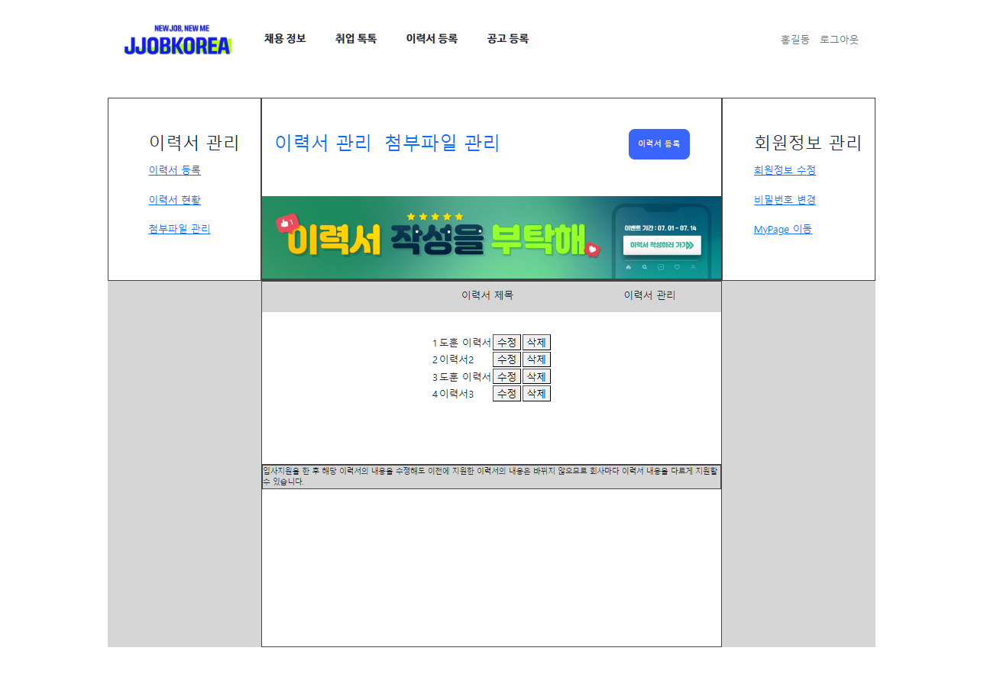
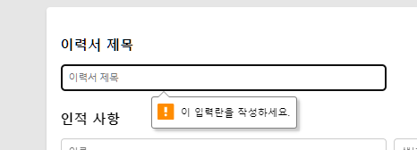

#  짭코리아

## 📄 목차

- 프로젝트 소개
- 개발 기간
- 개발 방식 및 팀원 소개
- 페이지 설명
    - [메인 페이지](#)
    - [로그인 페이지](#)
    - [회원 가입 페이지](#)
    - [채용 정보 페이지](#)
    - [채용 공고 상세 조회 페이지](#)
    - [취업 톡톡 페이지](#)
    - [이력서 등록 페이지](#)
    - [공고 등록 페이지](#)

## 🚀 프로젝트 소개

**잡코리아를 벤치 마킹한 구인 구직 사이트입니다.**

## 📅 개발 기간

2024.07.02 - 2024.07.17

## 👩‍💻 개발 방식 및 팀원 소개

**팀원 모두 풀 스택 개발 방식을 채택하여 프로젝트를 개발하였습니다.**

각 팀원은 다음과 같은 페이지를 담당하였습니다

- [박유진/팀장]: 메인 페이지, 채용 정보 페이지
- [김태후/팀원]: 채용 공고 상세 조회 페이지, 공고 등록 페이지
- [조해욱/팀원]: 구직자 게시판 페이지(취업 톡톡) CRUD 
- [문균호/팀원]: 로그인 페이지, 회원 가입 페이지
- [한도훈/팀원]: 이력서 메인 페이지, 이력서 작성 페이지

## ⚡ 페이지 설명

## 🚀 메인 페이지

### 🖥️ 메인 페이지 전체 화면

## 📝기능 설명

### 📌 네비게이션

- 각 항목을 클릭하면 해당 페이지로 이동합니다.
- 로고를 클릭하면 메인 페이지로 이동합니다.

### 📌 지금 뜨는 채용 공고 TOP 8 (✨특별 기능✨)

**: 조회수를 반영하여 선정된 인기 있는 채용 공고 순위를 확인할 수 있는 기능**

- 매일 아침 9시에 채용 공고들의 조회수를 0으로 초기화합니다.
- 모집 마감 기한이 지난 채용 공고는 순위에 반영되지 않습니다.
- 메인 페이지에 접속할 때마다 최신 조회수가 반영됩니다.
- 조회수가 동일한 경우, 기업 이름을 오름차순으로 정렬하여 순위를 매깁니다.
- 첫 번째 행 왼쪽부터 1, 2, 3, 4 순위, 두 번째 행 왼쪽부터 5, 6, 7, 8 순위로 순위를 표시합니다.
- 각 카드는 기업 대표 이미지, 기업 이름, 채용 공고 제목으로 이루어져 있습니다.
- 채용 공고 카드를 클릭하면 해당 채용 정보의 상세 보기 페이지로 이동합니다.

## 🚀 로그인 페이지

### 🖥️ 로그인 페이지 전체 화면

## 📝기능 설명

### 📌 로그인 화면

- 탭 인터페이스를 사용하여 개인과 기업회원을 선택할 수 있습니다.

- 아이디와 비밀번호가 틀렸을 경우, 알림창이 출력됩니다.

### 📌로그인 성공 시 메인 화면 표시

- 화면 상단 오른쪽에 유저의 이름이 표시되고, 로그아웃 버튼이 생성됩니다.
- 세션을 적용하여 각 페이지에서 로그인 상태를 유지할 수 있습니다.
- 로그아웃을 클릭하면 세션이 무효화됩니다.

## 🚀 회원가입 페이지

### 🖥️ 회원가입 페이지 전체 화면

## 📝기능 설명

- 탭 인터페이스를 통해 개인과 기업회원 선택이 가능합니다.

- 데이터베이스에 이미 존재하는 아이디로 가입 시 알림창이 표시됩니다.

- 회원가입 폼을 작성한 후 가입하기 버튼을 클릭하면 성공 메시지가 표시되며, 메인 화면으로 돌아갑니다.

## 🚀 채용 정보 페이지

### 🖥️ 채용 정보 페이지 전체 화면

## 📝기능 설명

### 📌 채용공고 상세검색 (✨특별 기능✨)

**채용 공고 사이트에서 사용자가 원하는 특정 조건으로 채용 공고를 검색하는 기능**

- 직무, 근무 지역, 기업 형태, 고용 형태를 선택할 수 있는 드롭다운 메뉴가 있습니다.

- 아무런 조건도 클릭되지 않았을 때는 '상세 조건을 클릭하세요.'라는 메시지가 표시됩니다.

- 각 메뉴에서 원하는 조건을 선택하면 클릭한 조건이 화면에 표시됩니다.
- 이미 선택된 조건은 중복 해서 표시되지 않습니다.
- 각 조건 옆에 있는 'X' 표시를 클릭하면 해당 조건이 삭제됩니다.
- '초기화' 버튼을 클릭하면 선택된 조건이 모두 삭제됩니다.

- 조건을 선택한 후에 '선택된 조건 검색하기' 버튼을 누르면 해당 조건에 해당하는 채용 정보 리스트가 출력됩니다.
- 아무 조건도 선택하지 않은 상태에서 '선택된 조건 검색하기' 버튼을 클릭하면 아무런 동작도 일어나지 않습니다.

- 선택된 조건으로 검색한 결과가 없을 때는 "검색 결과가 없습니다."라는 메시지가 나타납니다.

### 📌 채용 정보  리스트

- 채용 공고는 현재 날짜와 비교해 마감 기한이 가까운 순으로 정렬되며, 마감 기한이 동일한 경우에는 기업 이름을 기준으로 오름차순 정렬됩니다.
- 채용 마감 날짜까지의 남은 기간을 "D-날짜" 형식으로 표시하여, 사용자들이 남은 시간을 쉽게 이해하고 파악할 수 있도록 했습니다.
    - 채용 공고 마감 기한이 하루 이상 남았을 때 : `D-남은 날짜`
    - 채용 공고 마감 기한이 당일일 때 :    `D-day`
- 페이징 번호를 클릭하면 각 페이지에 채용 정보가 10개씩  출력됩니다.

## 🚀 채용 공고 상세 조회 페이지

### 🖥️ 채용 공고 상세 조회 페이지 전체 화면

## 📝기능 설명

- 채용 공고의 이미지와 함께 제목, 포지션 및 자격 요건, 근무 조건, 복지 및 혜택, 전형 절차, 유의 사항 등의 핵심 정보를 표시합니다.
    - 기본 이미지 표시: 이미지가 제공되지 않은 경우 기본 이미지가 표시됩니다.
    - 채용 제목: 채용 공고의 제목이 표시됩니다.
    - 포지션 및 자격 요건: 채용 포지션과 필요한 자격 요건이 상세히 설명됩니다.
    - 근무 조건: 근무 시간, 장소 및 기타 조건이 안내됩니다.
    - 복지 및 혜택: 제공되는 복지 및 추가 혜택이 나열됩니다.
    - 전형 절차: 채용 절차와 각 단계별 상세 설명이 제공됩니다.
    - 유의 사항: 지원 시 유의해야 할 사항이 안내됩니다.

## 🚀 구직자 게시판 메인 페이지

### 🖥️ 구직자 게시판 메인 페이지 전체 화면

## 📝기능 설명

### 📌 검색 기능 구현

- 드롭다운에서 선택한 조건에 맞게 검색할 수 있습니다.

### 📌 페이징 기능 구현

- 한 페이지에 10개의 항목씩 표시됩니다.

## 🚀 구직자 게시판 작성 페이지

### 🖥️ 구직자 게시판 작성 페이지 전체 화면

## 📝기능 설명

### 📌  사용자 정보 표시

- 현재 로그인한 사용자의 아이디가 상단에 표시됩니다.

### 📌 첨부 파일

- 원하는 사진을 선택하여 첨부할 수 있습니다.
- x 표시를 클릭하면 삭제됩니다.

- 첨부한 파일을 클릭하면 크게 볼 수 있습니다.
- 첨부한 파일을 다른 사용자가 다운로드 받을 수 있습니다.

### 📌댓글 작성 기능

- 사용자는 게시판에 댓글을 달 수 있습니다.

### 📌 권한 관리 기능

- 글의 작성자와 로그인한 사용자의 아이디가 일치할 경우
게시판의 수정 및 삭제가 가능합니다.

    
- 글의 작성자와 로그인한 사용자의 아이디가 일치하지 않을 경우
게시판의 수정 및 삭제가 불가능합니다.

## 🚀 이력서 메인 페이지

### 🖥️ 이력서 메인 페이지 전체 화면

## 📝기능 설명
- 이력서 등록버튼을 누르면 이력서 작성 페이지로 이동합니다.
- 로그인하지 않은 경우, 로그인 창으로 이동합니다.

## 🚀 이력서 작성 페이지

### 🖥️ 이력서 작성 페이지 전체 화면

## 📝기능 설명

### 📌기술 스택 선택

- 기술 스택을 3개까지 선택할 수 있으며,이를 초과하여 선택하려고 하면 알림창이 표시됩니다.

### 📌유효성 검사

- 필수 입력 항목이 누락된 상태에서 이력서 저장 버튼을 클릭하면 유효성 검사 오류 메시지가 출력됩니다.

### 📌이력서 저장

- [이력서 임시 저장] 버튼을 클릭시 알림창이 뜨며 이력서가 임시저장됩니다.
- [이력서 저장] 버튼을 누르면 이력서가 저장됩니다.

## 🚀 공고 등록 페이지

### 🖥️ 공고 등록 페이지 전체 화면

## 📝기능 설명