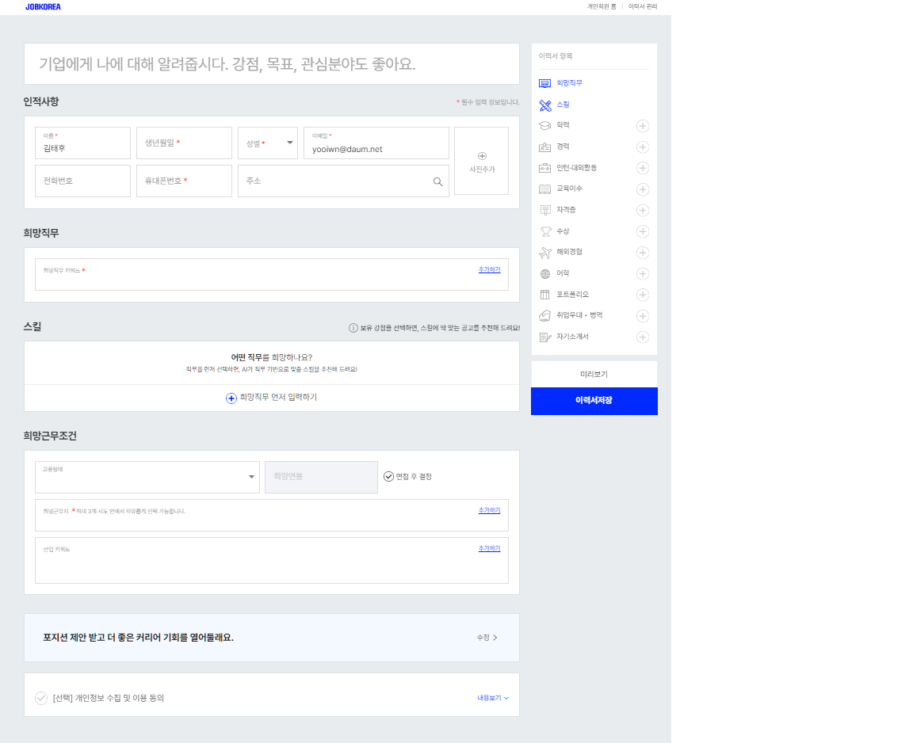
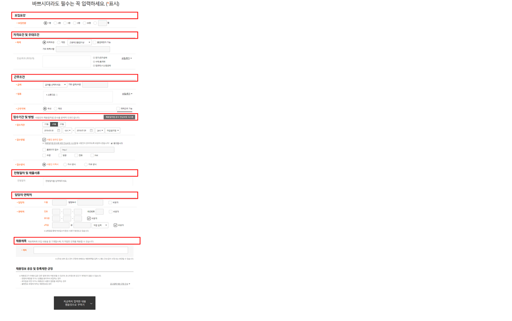

두 양식을 참고해 작성
# 구인 공고 입력 페이지

## 회사 정보
- **회사명**: 
- **설립연도**: 
- **근무지**: 
- **사원수**: 
- **산업분야**: 
- **홈페이지**: 

## 모집 정보
### 모집 부문 1
- **모집 부문**: 
- **직급/직책**: 
- **고용 형태**: 
- **모집 인원**: 
- **학력/경력**: 
- **직무 내용**: 
- **자격 요건**: 
- **우대 사항**: 

### 모집 부문 2
- **모집 부문### 구인 공고 입력 페이지

## 회사 정보
- **회사명**: 
- **설립연도**: 
- **근무지**: 
- **사원수**: 
- **산업분야**: 
- **홈페이지**: 

## 모집 정보
### 모집 부문 1
- **모집 부문**: 
- **직급/직책**: 
- **고용 형태**: 
- **모집 인원**: 
- **학력/경력**: 
- **직무 내용**: 
- **자격 요건**: 
- **우대 사항**: 

### 모집 부문 2
- **모집 부문**: 
- **직급/직책**: 
- **고용 형태**: 
- **모집 인원**: 
- **학력/경력**: 
- **직무 내용**: 
- **자격 요건**: 
- **우대 사항**: 

(필요 시 추가 모집 부문 작성)

## 근무 조건
- **근무 시간**: 
- **급여**: 
- **복리후생**: 
  - 지원금/보험: 
  - 휴일/휴가: 
  - 건강관리: 
  - 생활 편의 지원: 
  - 교육/훈련: 
  - 차량 관련 지원: 

## 전형 절차
- **접수 기간**: 
- **접수 방법**: 
- **전형 절차**: 

## 제출 서류
- **이력서**: 
- **자기소개서**: 
- **기타 서류**: 

## 문의 사항
- **담당자 이름**: 
- **연락처**: 
- **이메일**: 
- **회사 주소**: 

## 예시

### 회사 정보
- **회사명**: (주)시스윈로보틱스
- **설립연도**: 2004년
- **근무지**: 경기도 화성시 동탄
- **사원수**: 70명
- **산업분야**: 로봇 및 자동화 시스템
- **홈페이지**: syswin.co.kr

### 모집 정보
#### 모집 부문 1
- **모집 부문**: 소프트웨어 개발
- **직급/직책**: 대리/부장
- **고용 형태**: 정규직
- **모집 인원**: 00명
- **학력/경력**: 4년제 대학 졸업 이상, 관련 경력 2년 이상
- **직무 내용**: 반도체 디스플레이 설비 SW 개발
- **자격 요건**: C, C++, Python 등 프로그래밍 언어 능숙
- **우대 사항**: 석사학위 소지자

#### 모집 부문 2
- **모집 부문**: Vision/영상처리 개발
- **직급/직책**: 대리~부장
- **고용 형태**: 정규직
- **모집 인원**: 00명
- **학력/경력**: 4년제 대학 졸업 이상, 관련 경력 2년 이상
- **직무 내용**: 머신비전, 영상처리 알고리즘 개발
- **자격 요건**: C#, C++, C, Python, 영상처리 라이브러리
- **우대 사항**: 석사/박사 학위

### 근무 조건
- **근무 시간**: 주 5일(08:00~17:00)
- **급여**: 회사 내규에 따름
- **복리후생**: 지원금/보험, 건강관리, 교육/훈련, 차량 관련 지원 등

### 전형 절차
- **접수 기간**: 2024년 6월 20일까지
- **접수 방법**: 온라인 지원
- **전형 절차**: 서류전형 → 면접전형 → 최종합격

### 제출 서류
- **이력서**: 
- **자기소개서**: 
- **기타 서류**: 경력 증명서 등

### 문의 사항
- **담당자 이름**: 유호희 대리
- **연락처**: 031-203-0923
- **이메일**: company@example.com
- **회사 주소**: 경기도 화성시 동탄기흥로 64-4
