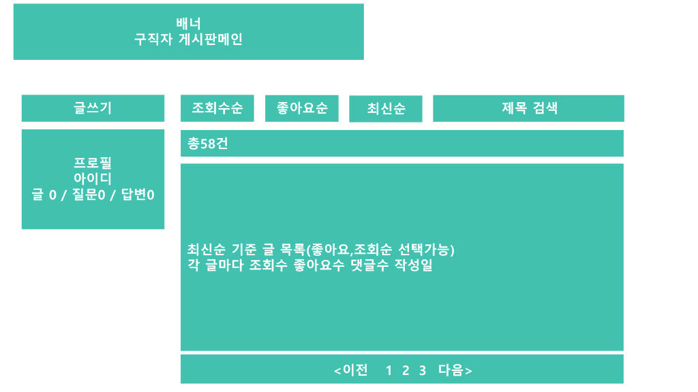
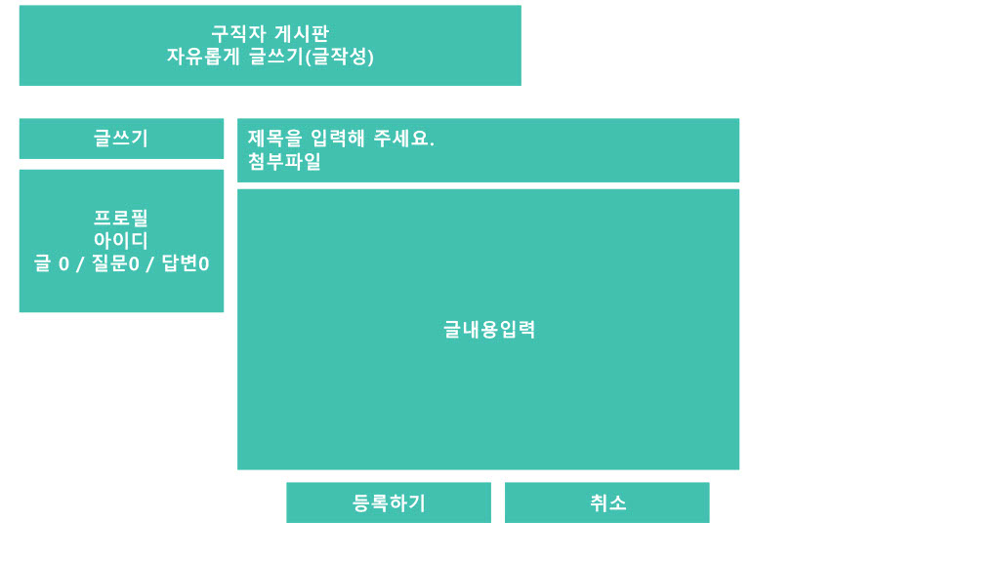
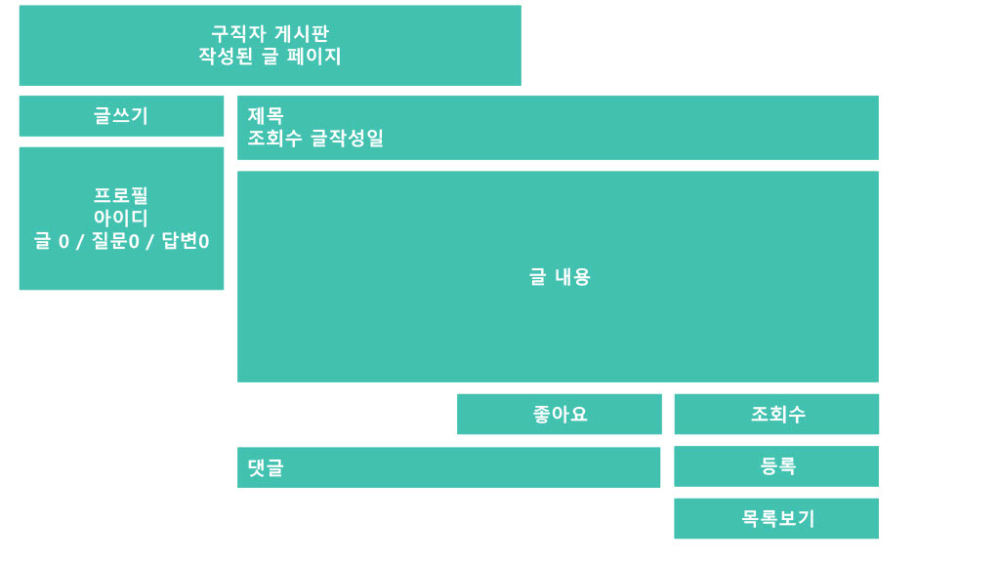
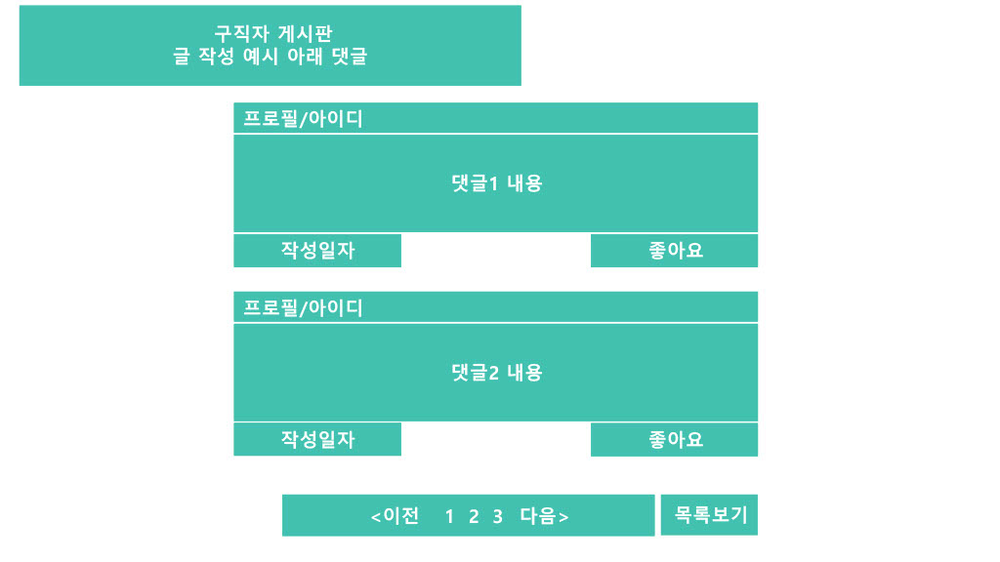
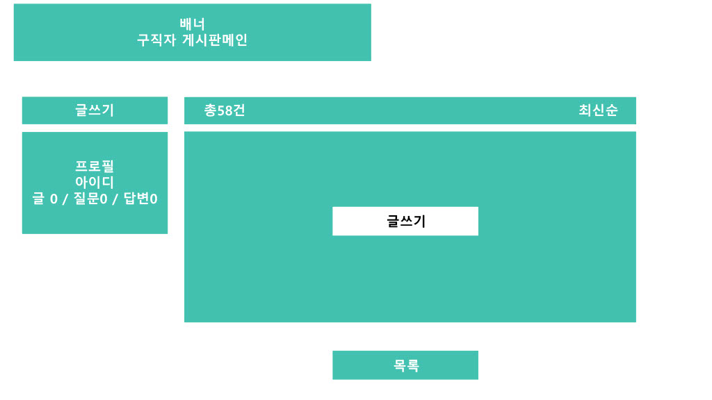
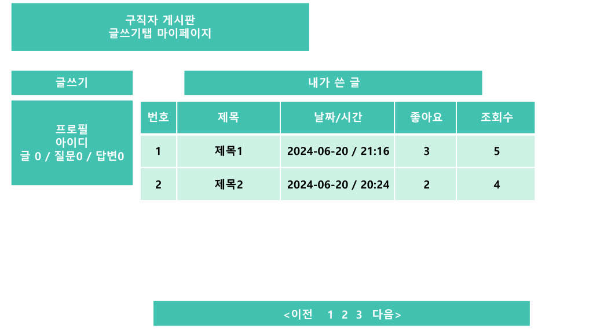

  
## 구직자게시판 메인페이지  
- [글쓰기] 클릭시 [구직자게시판 글작성페이지] 로 이동한다.  
[프로필] 은 표기만 하고싶다.  
- [조회수], [좋아요], [최신순] 클릭시 해당 기준으로 글을 정렬한다.  
- [제목검색] 클릭시 제목기준으로 글을 검색해서 보여준다.  
(위의 두 기능은 기본적으로 겹치지 않게한다.  
시간적여유가 된다면 제목검색후 기본값은 최신순 좋아요 조회순 기준 정렬이 가능하게 한다)  
- 각 글마다 조회수, 좋아요수, 댓글수, 작성일 표기한다.  
- [이전][다음] 클릭시 페이지 이동이 가능하게 한다.    

## 구직자게시판 글작성페이지  
- [첨부파일] 클릭시 첨부파일 첨부기능을 넣는다.(여유된다면)  
- 제목과 글내용 입력후 [등록하기] 클릭시 [구직자게시판 글보기페이지] 로 이동한다.  
- [취소] 시 [구직자게시판 메인페이지]로 이동한다.   
- 좌측 [글쓰기] 필요x 삭제   

## 구직자게시판 글보기페이지  
제목, 조회수, 글 작성일, 글내용이 표시 되도록한다.  
- [좋아요] 클릭시 좋아요가 1 오른다.   
- [조회수] 는 글을 해당글을 목록에서 클릭시 카운트된다.  
- 댓글 작성후 [등록] 클릭시 페이지가 새로고쳐지며 댓글이 등록된다.  
- [목록보기] 클릭시 [구직자게시판 메인페이지]로 이동한다.  

## 구직자게시판 글보기댓글페이지  
해당페이지는 글 작성페이지의 아래에 위치하도록한다.  
각 댓글당 프로필과 아이디를 표시하도록 한다.  
댓글 내용을 출력한다.  
댓글의 작성일자를 출력하게 한다.  
- [좋아요] 클릭시 좋아요가 1 오른다.  
- [이전][다음] 클릭시 페이지 이동이 가능하게 한다.  
- [목록보기] 클릭시 [구직자게시판 메인페이지]로 이동한다.  

## 구직자게시판 마이페이지(글안적힘)  
- [글쓰기] 클릭시 [구직자게시판 글작성페이지] 로 이동한다.(좌측 글쓰기 버튼 삭제x)  
작성한 글의 수와를 표시하고 최신순으로 나열한다.  
- [목록보기] 클릭시 [구직자게시판 메인페이지]로 이동한다.  

## 구직자게시판 글적힌마이페이지  
- [글쓰기] 클릭시 [구직자게시판 글작성페이지] 로 이동한다.  
번호, 제목, 날짜/시간, 좋아요, 조회수 가 표시되게한다.  
글의 순서는 날짜/시간순으로 정렬한다.  
- [이전][다음] 클릭시 페이지 이동이 가능하게 한다.  

