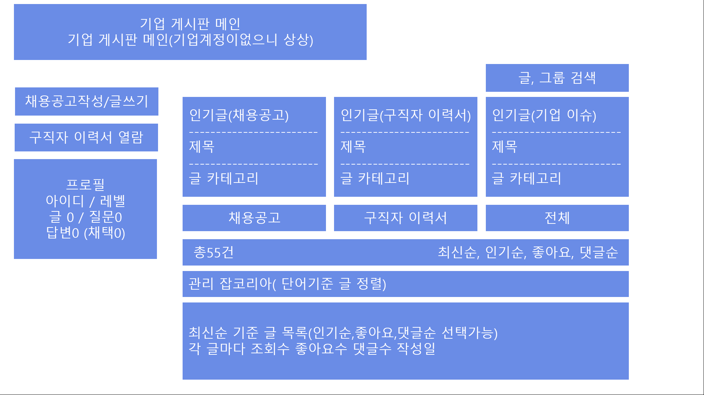
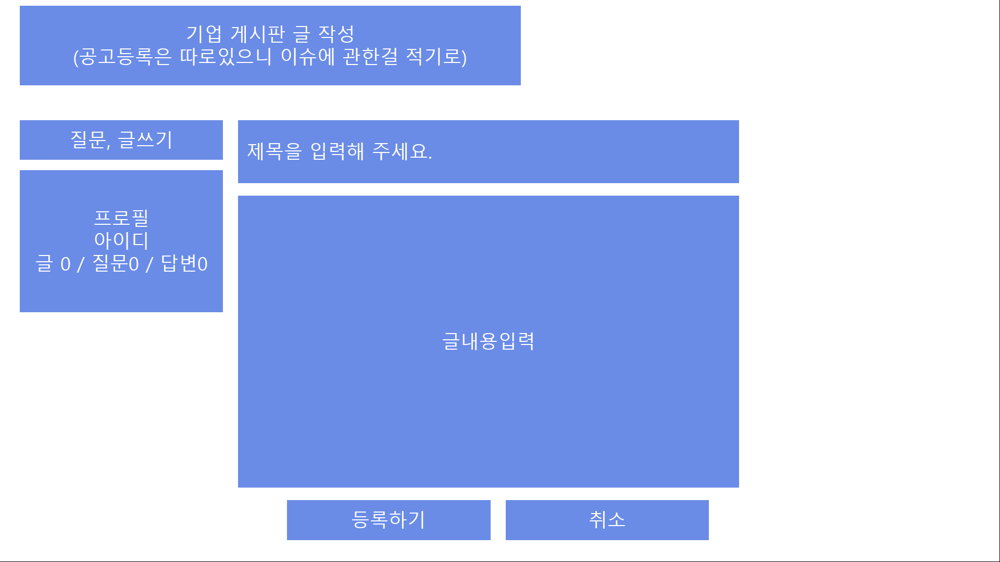
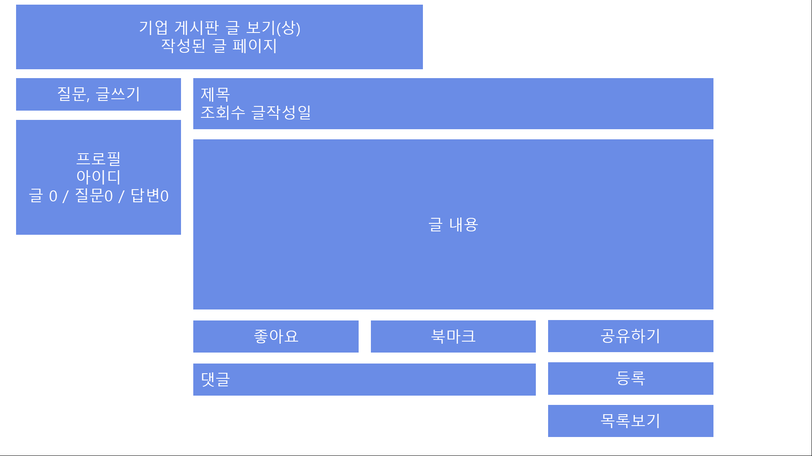
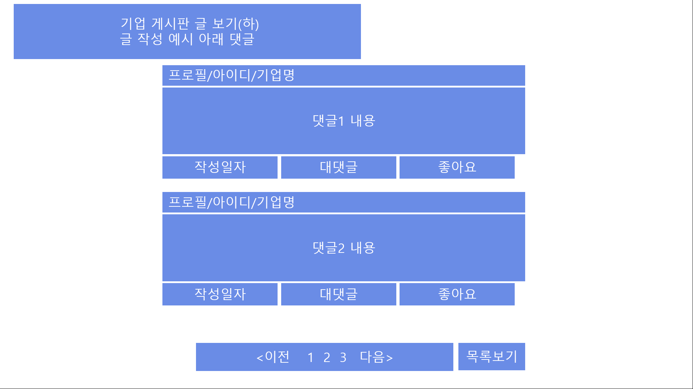
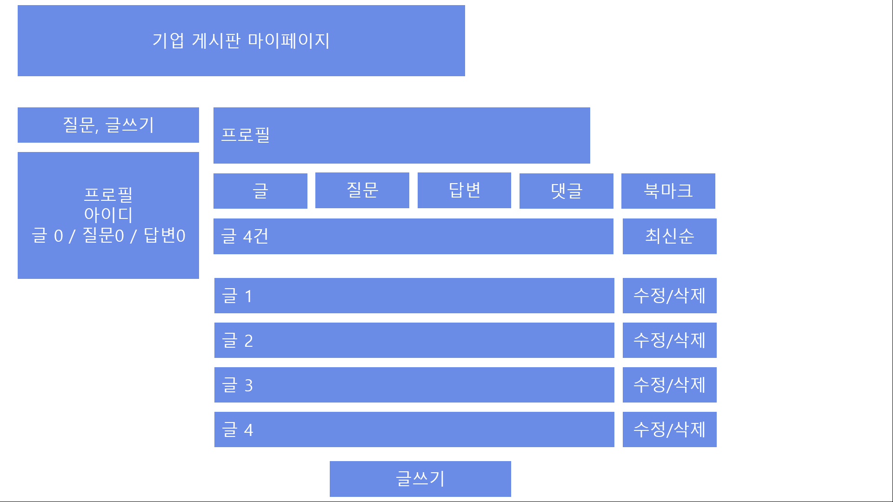

-----------------------------------------------------------------------------------------
## 기업 커뮤니티 게시판 구현

## 메인
자유 게시판의 글들의 목록을 보여준다.
원하는 글을 클릭해서 해당 글의 내용을 볼 수 있으며 조회수, 아이디, 제목등이 표시된다
출력되는 글은 10개정도 그 외에는 클릭을 통해 다음 페이지로 넘겨서 출력한다.
글작성 버튼을 눌러서 글작성 페이지로 이동한다.

## 상세글 내용 페이지
입력한 제목
내용을 출력한다.
글을 수정할 수 있는 버튼을 통해 글수정 페이지로 이동한다.
글삭제 버튼을 이용해 글을 삭제하는 페이지로 이동한다.
글목록 돌아가기 버튼을 통해 메인 글목록 페이지로 이동한다.

댓글 기능을 구현한다면 글을 입력할 수 있는 텍스트 란과 작성하기 버튼을 만든다.
해당 글은 짧은 글만 가능하며(150~200자) 닉네임 글내용 수정/삭제 버튼이 있다.

## 기업 회원 구직회원 이력서 열람 목록
대가를 지불하는 기업회원에게 제공하는 기능으로 기업 커뮤니티 게시판에 추가한다.
구직자들의 이력서를 리스트 출력되어 있고 관심있는 이력서를 클릭하면 구직자 이력서 페이지로 이동한다.
글을 작성하기보다 정보 조회 목적의 게시판으로 활용된다.

## 구직자 이력서 상세 페이지
구직자의 이름/ 생년월일/ 성별/ email/휴대전화/주소/구직자의 개발능력(java, jsp, 스프링,html 등) /학력
/경력/ 포트폴리오/자기소개서를 출력한다.
이력서 열람 목록으로 이동하는 글목록으로 버튼이 있다.
입사제안 버튼을 누르면 해당 구직자에게 입사를 제안하는 알람이 가도록 설정한다.

