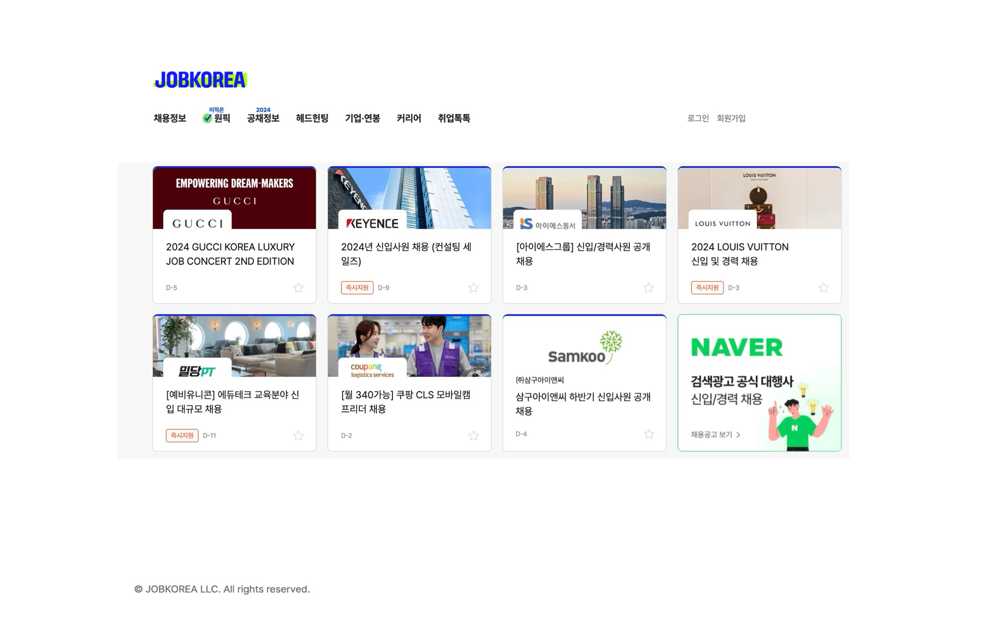
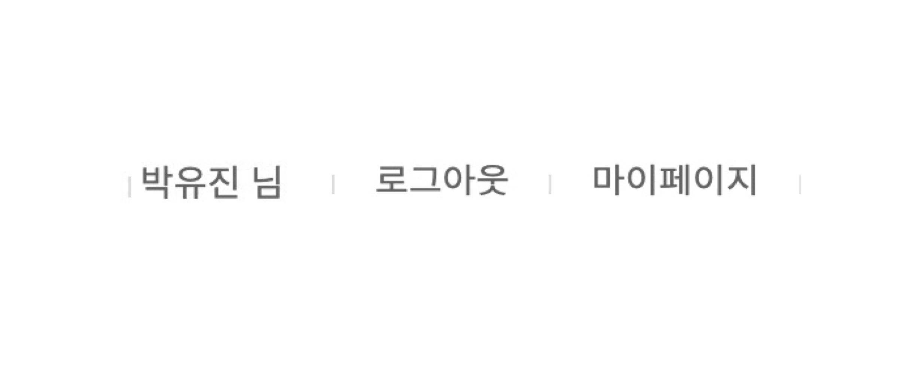

# 메인 화면 구성 이미지

## 메인 페이지

## 로그인 후 상단바 표시 예시

# 구성 설명

## 로고
프로젝트 로고
## 카테고리
(상의 후 결정)
## 로그인 전
- 로그인버튼을 클릭하면 로그인 페이지로 이동한다. 
- 회원가입 버튼을 클릭하면 회원가입 페이지로 이동한다.
## 로그인 후
[예시](#로그인-후-상단바-표시-예시)
- 유저의 이름이 표시된다.
- 마이페이지 버튼을 클릭하면 개인 정보 창으로 이동한다. (보류)
- 로그아웃 버튼을 클릭하면 [로그아웃 하시겠습니까?] 라는 알림창을 표시하고 [예]버튼을 클릭하면 [로그아웃 되었습니다.]라는 알림창과 함께 로그아웃된다. 
## 채용 공고 리스트
- 8개의 채용 공고 리스트를 보여준다.
- 8개 이상의 채용 공고 리스트가 등록될 경우 [더보기]버튼을 클릭할 때마다 8개의 채용 공고 리스트가 추가되어 화면에 보여진다. 
- 보여지는 순서는 채용 공고 이름 오름차순으로 표시된다.
- 지원 기한이 지난 채용 공고는 화면에 표시되지 않는다. 
- 제목은 채용 공고 명을 보여준다.
- 기업의 이름이 표시된다.
- 이미지는 기업이 채용 공고를 등록할 때 업로드한 이미지를 보여준다.
- 채용 공고를 클릭하면 해당 기업이 업로드한 채용 공고 페이지로 이동된다.
- ex)D-1 처럼  날짜 계산 기능을 이용해 남은 지원 일자를 표시한다.(보류)
- 별모양을 클릭하면 해당 공고의 정보가 구직자의 기업 즐겨 찾기 리스트에 추가된다. (보류)

