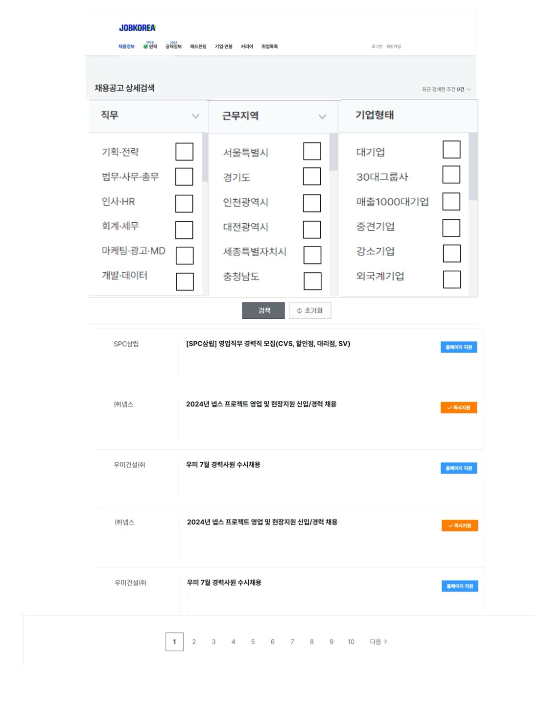

# 채용 정보 설계 이미지

# 기능 설명

## 체크박스 필터링

- 사용자가 근무 유형, 근무 지역, 기업 형태를 선택할 수 있도록 체크박스를 제공합니다.
- 직무 : - 근무 유형을 선택할 수 있는 체크박스를 제공합니다. 
- 근무 지역 : 서울, 부산, 대구 등 다양한 근무 지역을 선택할 수 있는 체크박스를 제공합니다.
- 기업 형태 : 대기업, 중소기업, 스타트업 등 다양한 기업 형태를 선택할 수 있는 체크박스를 제공합니다.

## 검색하기 버튼
- 사용자가 체크박스를 통해 원하는 조건을 선택한 후, '검색하기' 버튼을 클릭합니다.
- 체크박스를 선택하지 않고 '검색하기' 버튼을 클릭하면 전체 채용 정보를 표시합니다.
- 조건에 맞는 채용 정보가 없을 경우 "채용 공고가 없습니다."라는 메시지를 화면에 출력합니다.
- 채용 공고는 지원 마감 날짜를 기준으로 오름차순으로 정렬됩니다.

## 초기화 버튼
- '초기화' 버튼을 클릭하면 사용자가 선택한 체크박스가 초기 상태로 리셋됩니다.

## 기본 채용 정보 리스트
- 사용자가 채용 정보 페이지에 들어왔을 때 채용 공고 리스트가 표시됩니다.
- 한 페이지 당 10개의 채용 정보가 표시됩니다.
- '기업 이름'과 '채용 정보 제목'이 표시됩니다.
- 채용 정보는 지원 마감 날짜를 기준으로 오름차순으로 정렬됩니다.

##  채용 정보 상세보기 기능
- '기업 이름'을 클릭하면 해당 채용 정보의 상세 페이지로 이동합니다.
- '채용 정보 제목'을 클릭하면 해당 채용 정보의 상세 페이지로 이동합니다.
- '즉시지원' 버튼을 클릭하면 해당 채용 정보의 상세 페이지로 이동합니다.

## 페이징 기능
- 페이지 번호를 클릭하면 사용자는 해당 페이지로 이동하여 추가 채용 정보를 확인할 수 있습니다. 
- '다음' 버튼을 클릭하면 현재 페이지에서 다음 페이지로 이동됩니다.
- 예시) 1페이지에서 '다음'버튼을 클릭하면 2페이지가 표시됩니다.

